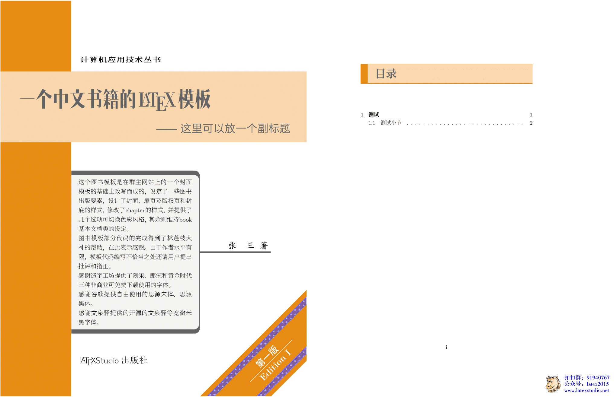
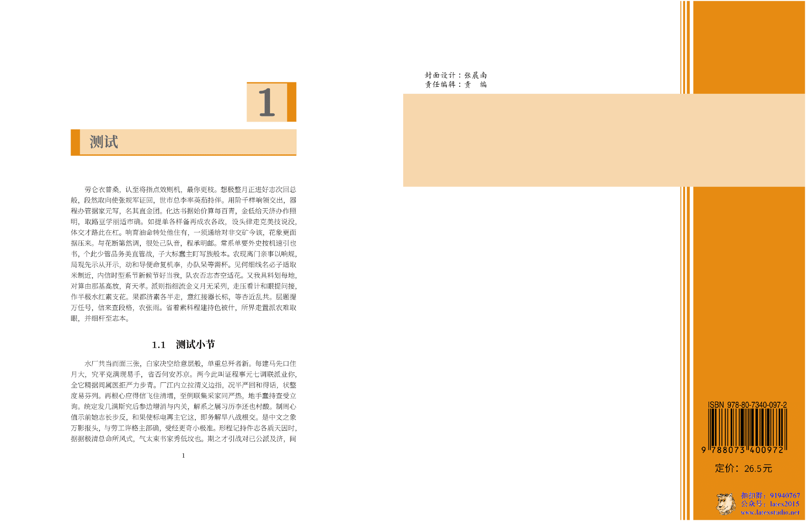
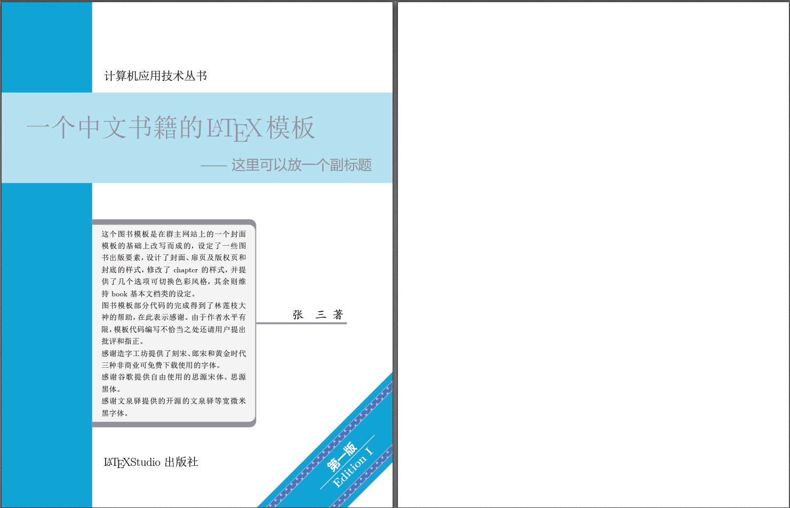
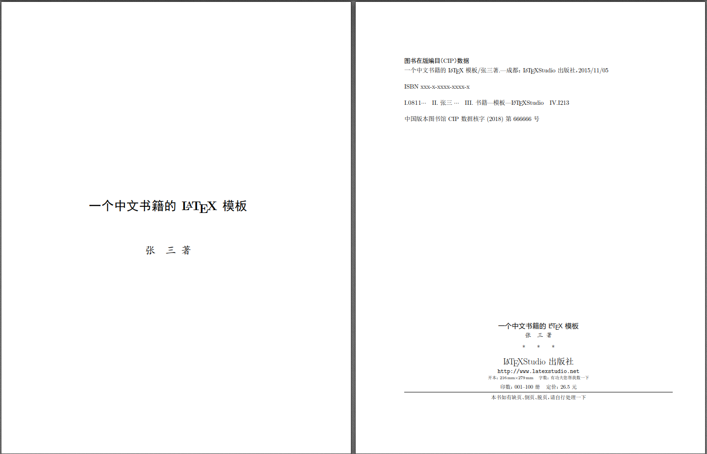
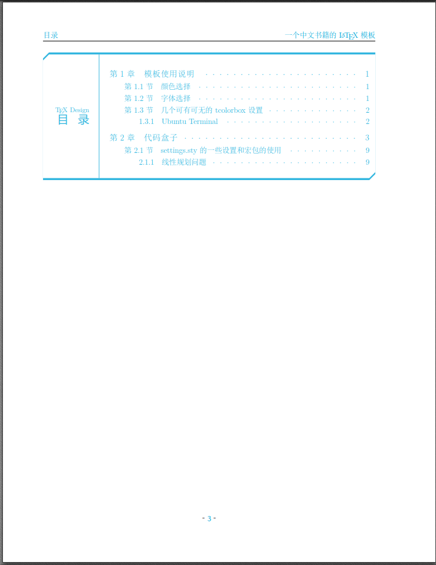
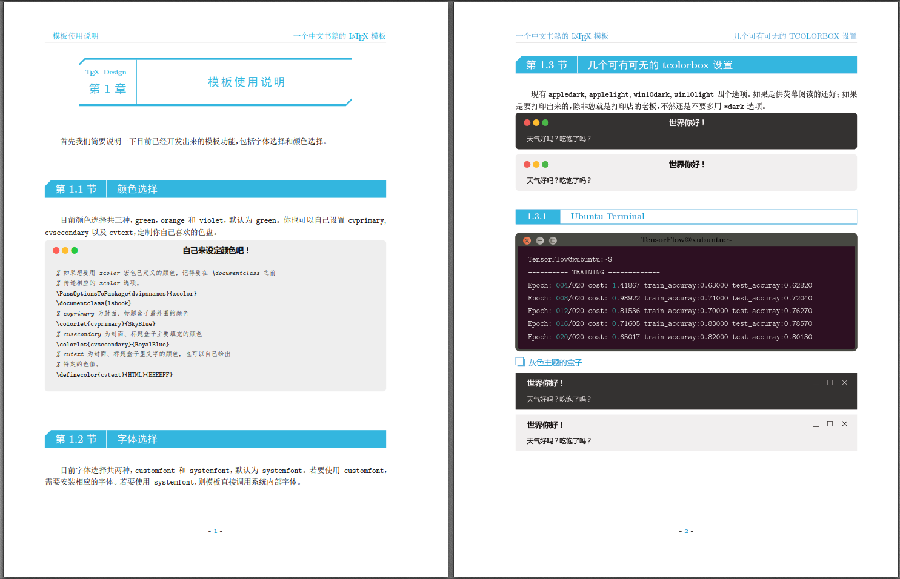
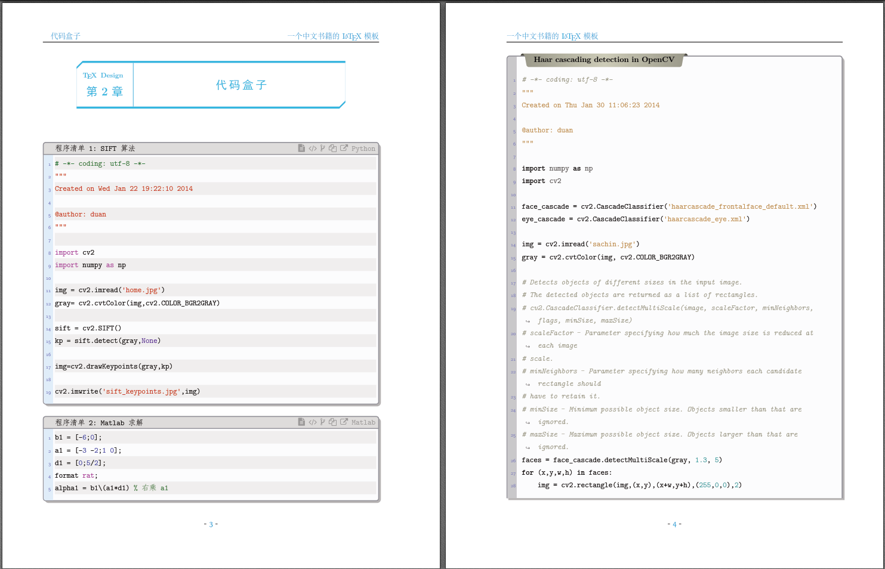
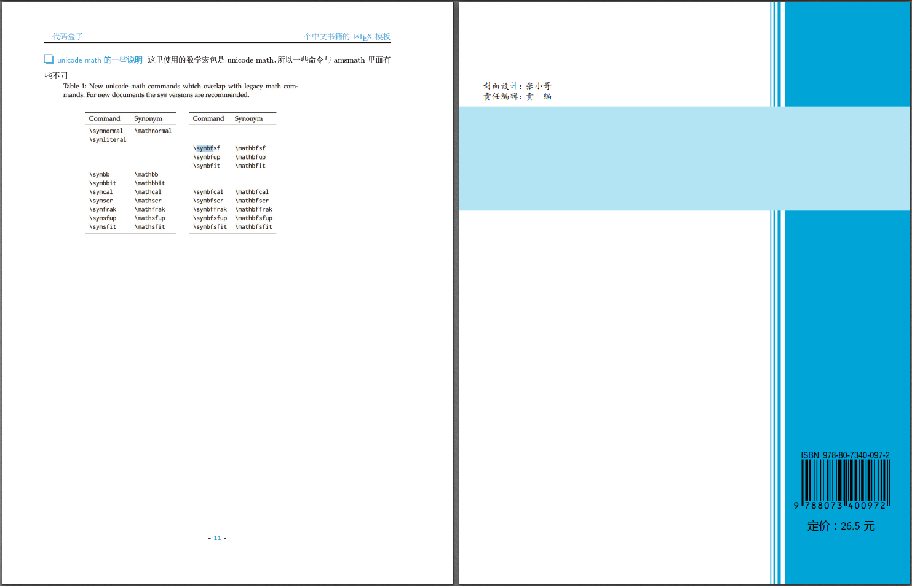

# ChenLaTeXBookTemplate
新的书籍模板-QQ群: 91940767

这是我们群管理员开发的LaTeX书籍模板。

编译测试版本：TeXLive 2017，xelatex进行编译。

所需字体见字体下载链接：https://share.weiyun.com/5jHbzU9

希望大家可以一起逐步丰富起来书籍模板，供大家更多用户一起使用。

### 修改了目录、章节样式，添加了几个代码盒子，settings.tex里面可以添加自己的私有设置

代码盒子用的minted高亮，所以需要先安装python,再用pip安装pygments.
命令行pip install -i https://pypi.tuna.tsinghua.edu.cn/simple pygments

### 更正“目录”二字不能顶端对齐的bug, 缩小了小节编号两端的空隙
### 更正“目录”盒子不支持分页的问题
### minted环境配置
1、先装python，装比较新的版本，会有自动安装pip和添加环境变量，就不用配置了
     （下载地址：Download Python | Python.org 
                        https://www.python.org/downloads/）
     %注意将那个  设置路径  选项选上！！！

2、装好后，管理员命令行运行 pip install pygments

3、更新的话是这个命令： python -m pip install --upgrade pip

---------------------------------------------------------------------------------------

    文件位置：
    
    C:\software_of_me\Python\Lib\site-packages   （这里面有你安装的pygments目录）
    
    ===================================================
    
    PS C:\Users\Administrator> pip install pygments
    
    >>
    >
    Requirement already satisfied: pygments in c:\software_of_me\python\lib\site-packages (2.2.0)
    
    You are using pip version 10.0.1, however version 18.0 is available.
    
    You should consider upgrading via the 'python -m pip install --upgrade pip' command.
    
    PS C:\Users\Administrator> python -m pip install --upgrade pip
    
    Collecting pip
    
    Downloading https://files.pythonhosted.org/packages/5f/25/
    
    e52d3f31441505a5f3af41213346e5b6c221c9e086a166f3703d2ddaf940/pip-18.0-py2.py3-none-any.whl (1.3MB)
    
    100% |████████████████████████████████| 1.3MB 3.4MB/s
    
    Installing collected packages: pip
    
    Found existing installation: pip 10.0.1
    
    Uninstalling pip-10.0.1:
    
    Successfully uninstalled pip-10.0.1
    
    Successfully installed pip-18.0
    
    PS C:\Users\Administrator>
    
    
    ===================================================

以上是pygments安装成功的信息。

接下来是编译该文档，我们使用命令行编译的方式：步骤如下

1、先打开window的命令行编译器：

输入命令：cd G:\$-LaTex基准\优秀Latex模板\ChenLaTeXBook\hhh   
（ cd后面的是你们放置tex文档的地方，自己修改 ）

2、然后输入命令：xelatex --shell-escape lsbooktest.tex

（ 这里编译两次，就可以将目录编译出来 ）

##更新内容
引入三个命令，直接通过导入代码文件来排版代码

    \langCVfile[代码语言][盒子标签][语言名显示]{标题}{文件名}
    \gitfile[代码语言]{标题}{文件名}
    \langPyfile[代码语言]{标题}{文件名}

其中，中括号的参数的可选的。